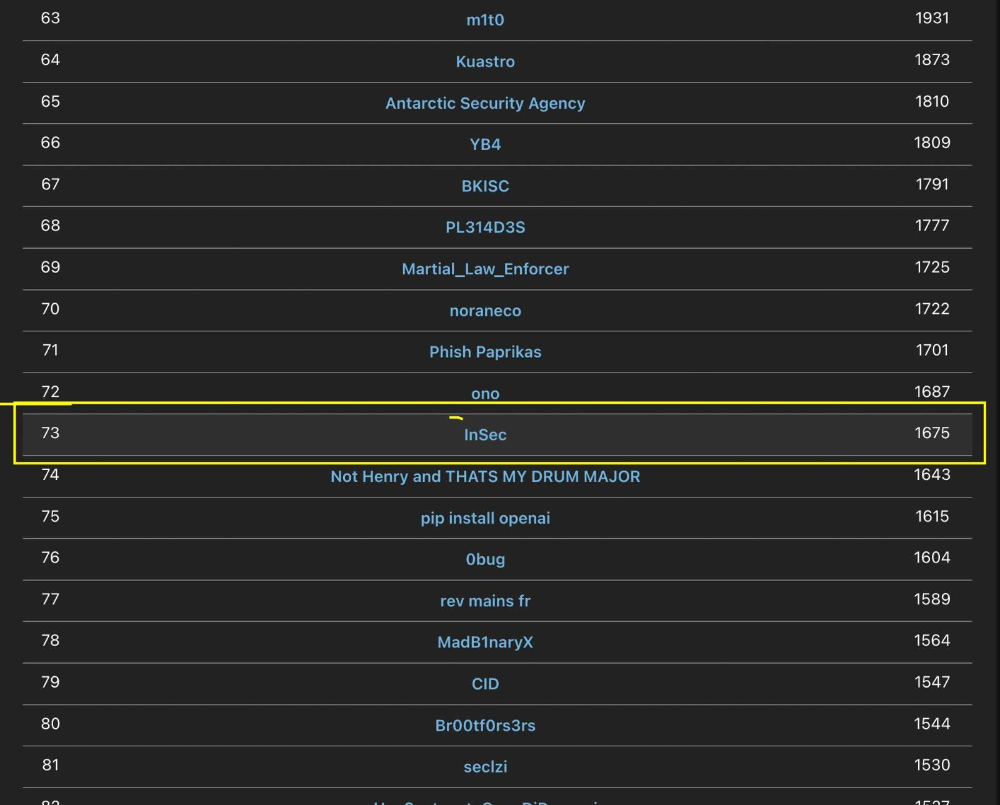

# Solution for some challenges from the TJCTF 2024

TJCTF is an international cybersecurity competition hosted by TJCSC, a group of students from Thomas Jefferson High School for Science and Technology in Northern Virginia.

Prizes are sponsored by Trail of Bits and Zellic.

Twitter: https://twitter.com/tjctf
Email: contact@tjctf.org
Discord: https://discord.gg/w5xapGP

Competition is online.