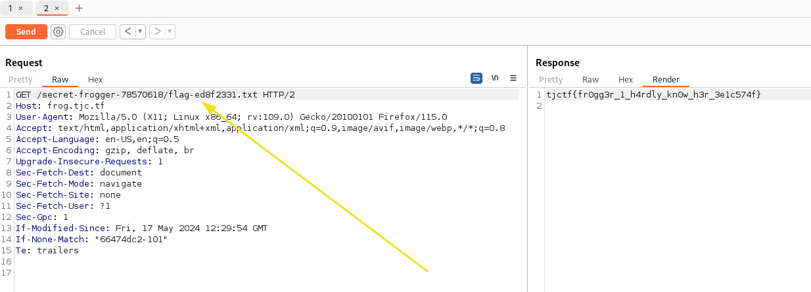

# Path finding
The goal of this challenge was to find the path that lead to flag. Let's see what we have on the **robots.txt route** 

```sh
http https://frog.tjc.tf/robots.txt
HTTP/1.1 200 OK
Accept-Ranges: bytes
Content-Length: 50
Content-Type: text/plain
Date: Sun, 19 May 2024 19:46:03 GMT
Etag: "66474dc2-32"
Last-Modified: Fri, 17 May 2024 12:29:54 GMT
Server: nginx/1.25.5

User-agent: *
Disallow: /secret-frogger-78570618/
```

## Getting the flag

As you can see we the /secret-frogger-78570618/ is disallowed however we can browser to there and lead to the flag

```sh
http https://frog.tjc.tf/secret-frogger-78570618/
HTTP/1.1 200 OK
Accept-Ranges: bytes
Content-Length: 7665
Content-Type: text/html
Date: Sun, 19 May 2024 19:49:13 GMT
Etag: "66474dc2-1df1"
Last-Modified: Fri, 17 May 2024 12:29:54 GMT
Server: nginx/1.25.5

<!DOCTYPE html>
<html lang="en">
<head>
    <meta charset="UTF-8">
    <meta name="viewport" content="width=device-width, initial-scale=1.0">
    <title>secret frogger (do not leak)</title>
</head>
<body>
    🐸🐸🐸🐸🐸🐸🐸🐸🐸🐸🐸🐸🐸🐸🐸🐸🐸🐸🐸
    <a href="flag-ed8f2331.txt" style="text-decoration: none;">🐸</a>🐸🐸🐸🐸🐸🐸🐸🐸
    🐸🐸🐸🐸🐸🐸🐸🐸🐸🐸🐸🐸🐸🐸🐸🐸🐸🐸🐸
    🐸🐸🐸🐸🐸🐸🐸🐸🐸🐸🐸🐸🐸🐸🐸🐸🐸🐸🐸
</body>
</html>
```
Nice we found the flag route


Et voilà tjctf{fr0gg3r_1_h4rdly_kn0w_h3r_3e1c574f}