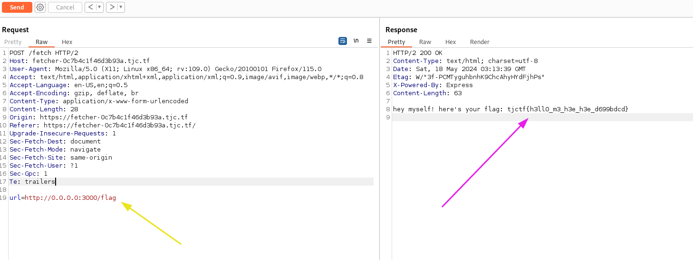

# Fetcher

This was really fun to solve, after analysing the source code provided we can break the code down and focus on theses thow functions:

### IP checking 
```js
app.post('/fetch', async (req, res) => {
    const url = req.body.url;

    if (!/^https?:\/\//.test(url))
        return res.send('invalid url');

    try {
        const checkURL = new URL(url);

        if (checkURL.host.includes('localhost') || checkURL.host.includes('127.0.0.1'))
            return res.send('invalid url');
    } catch (e) {
        return res.send('invalid url');
    }

    const r = await fetch(url, { redirect: 'manual' });

    const fetched = await r.text();

    res.send(fetched);
});
```
This function is request handler and it does sereval check on the request by extracting the url from the body. If it's not start with **http:// or https://** it's send back a response with **invalid url**. Another important check here is done on the URL's host, if the host is 'localhost'or '127.0.0.1' it's send back **'invalid url'**


### IP restriction bypassing
```js
app.get('/flag', (req, res) => {
    if (req.ip !== '::ffff:127.0.0.1' && req.ip !== '::1' && req.ip !== '127.0.0.1')
        return res.send('bad ip');

    res.send(`hey myself! here's your flag: ${flag}`);
});
```
- It checks if the IP address of the incoming request (`req.ip`) is either '::ffff:127.0.0.1', '::1', or '127.0.0.1'. These are the IPv6 and IPv4 representations of localhost, respectively. 

- If the IP address of the request is not one of these it sends a response with the text 'bad ip' and ends the function execution.

But the can bypass this check by using the default IPv4-Based rounting which is **0.0.0.0**. From here we solved the challenge let's make request on this route ?url=0.0.0.0:3000/flag and see.

.

Et voilà !! we got our flag: tjctf{h3ll0_m3_h3e_h3e_d699bdcd}

