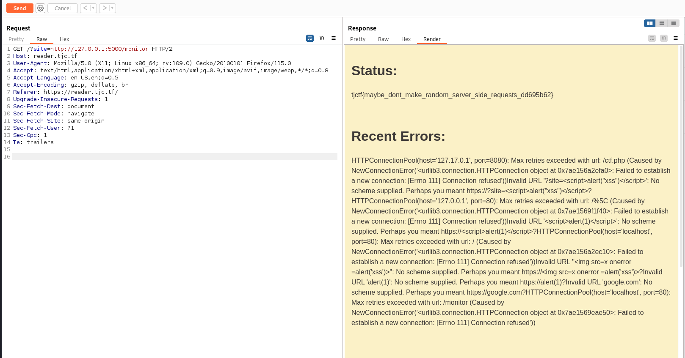

# Code analysis
This challenge we had access to the source for more analysis and better understanding of what is going on the application.

After a going throught the code provided we can see how the server maange the requests and store logs. However if we made a request from localhost on the /monitor route we can gain acces to the whole logs and the flag.

```python
@app.route("/monitor")
def monitor():
    if request.remote_addr in ("localhost", "127.0.0.1"):
        return render_template(
            "admin.html", message=flag, errors="".join(log) or "No recent errors"
        )
    else:
        return render_template("admin.html", message="Unauthorized access", errors="")

```
# Challenge solving
Now let's see how the server respond to request made to the **monitor route from localhost**



tjctf{maybe_dont_make_random_server_side_requests_dd695b62}
Et voilà we got our flag. 
